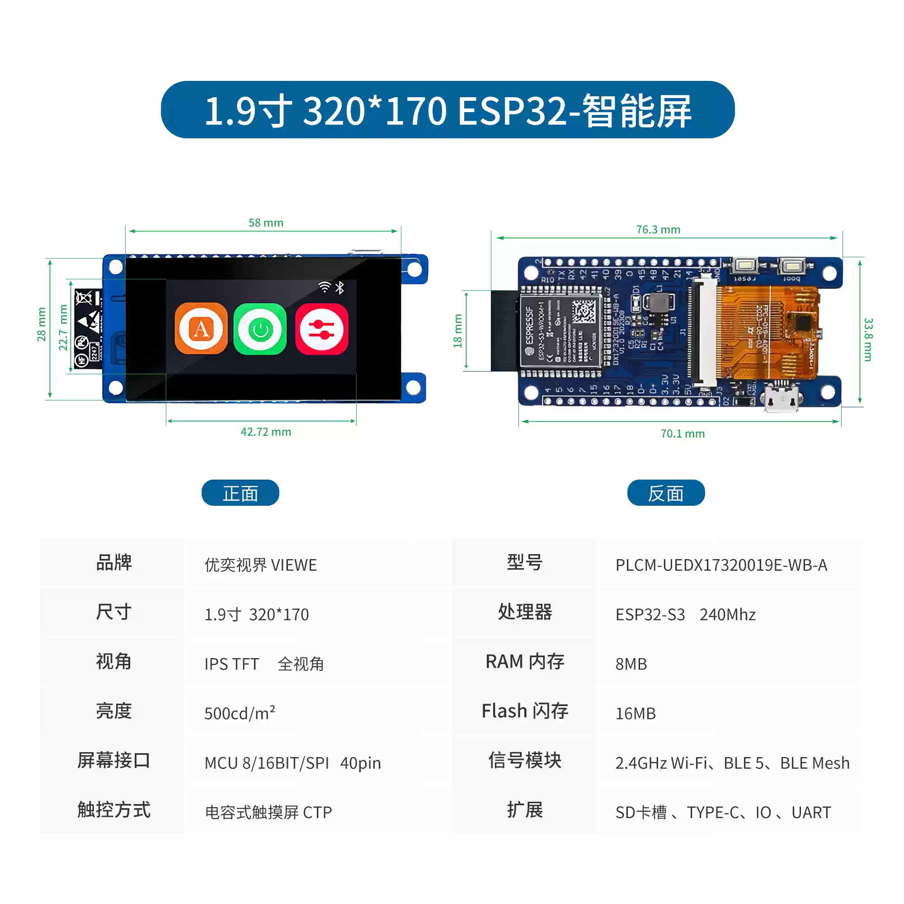

<h1 align="center">VIEWE ESP32-S3 智能显示屏快速指南</h1>

    
    <h1 style="font-size: 18px;">型号：UEDX24320024E-WB-A</h1>

* **[English Version](./README.md)**

## 硬件概述

### 1. MCU

* 芯片：ESP32-S3-R8
* PSRAM：8M（八线 SPI）
* FLASH：16M
* 更多详情，请访问 [乐鑫 ESP32-S3 数据手册](https://www.espressif.com.cn/sites/default/files/documentation/esp32-s3_datasheet_en.pdf)

### 2. 屏幕

* 尺寸：1.9 英寸 IPS 屏幕
* 分辨率：170×320 像素
* 屏幕类型：IPS
* 驱动芯片：GC9307
* 兼容库：Arduino GFX 库
* 总线通信协议：SPI
* 更多详情：[显示数据手册]()

### 3. 触摸

* 芯片：CHSC6413
* 总线通信协议：IIC
* 更多详情：[触摸 IC 数据手册 (英文)]()

## 硬件连接

- USB1 用于编程、调试或供电（5V/1A 适配器）。
- 编程时，按住 `BOOT` 按钮可进入下载模式。

## 快速开始

### 软件框架配置

| 支持的 IDE      | 版本                |
| --------------- | ------------------- |
| `[ESP-IDF]`    | `[V5.1/5.2/5.3]`    |
| `[Arduino IDE]`| `[esp32 >= v3.0.7]` |
| `[PlatformIO IDE]` |                    |

### ESP-IDF 框架（[新手教程]()）
- 支持版本：v5.1/5.2/5.3
- 从仓库下载示例代码，直接编译运行即可。
- 仓库地址：[examples](examples)

### Arduino 框架（[新手教程]()）
1. 安装 [Arduino IDE](https://www.arduino.cc/en/software)，请根据您的系统类型选择安装。
2. 安装 ESP32 核心：在 `开发板管理器` 中搜索并下载 `esp32`（由 Espressif 提供，版本 >= v3.0.7）。
3. 安装所需库：
    * 搜索并安装 `GFX Library for Arduino`（作者：Moon）。
    * 安装 `LVGL`（v8.4.0）库。
4. 打开示例：下载本仓库的示例并打开。
5. 在 `工具` 菜单中选择正确的设置，如下表所示：
#### ESP32-S3
| 设置                               | 值                                  |
| :-------------------------------: | :-------------------------------: |
| 开发板                             | ESP32S3 Dev Module           |
| CPU 频率                           | 240MHz (WiFi)                 |
| 内核调试级别                       | 无                              |
| 启动时 USB CDC                     | 启用                           |
| 启动时 USB DFU                     | 禁用                           |
| 事件运行于                         | Core 1                         |
| 闪存模式                           | QIO 80MHz                      |
| 闪存大小                           | 16MB (128Mb)                  |
| Arduino 运行于                     | Core 1                         |
| 启动时 USB 固件 MSC                | 禁用                           |
| 分区方案                           | 16M Flash (3MB APP/9.9MB FATFS) |
| PSRAM                              | OPI PSRAM                      |
| 上传模式                           | UART0 / Hardware CDC           |
| 上传速度                           | 921600                         |
| USB 模式                           | Hardware CDC and JTAG          |
   
6. 选择正确的端口。
7. 点击右上角的 "<kbd>[√](image/8.png)</kbd>" 进行编译。若编译无误，将开发板连接至电脑，点击右上角的 "<kbd>[→](image/9.png)</kbd>" 即可下载程序。

### PlatformIO（[新手教程]()）
1. 安装 [Visual Studio Code](https://code.visualstudio.com/Download)，请根据系统类型选择安装。

2. 打开 Visual Studio Code 侧边栏的“扩展”部分（或使用 <kbd>Ctrl</kbd>+<kbd>Shift</kbd>+<kbd>X</kbd> 打开扩展面板），搜索“PlatformIO IDE”扩展并下载安装。

3. 扩展安装期间，可以前往 GitHub 下载程序。点击绿色文字的 "<> Code" 按钮即可下载主分支。

4. 扩展安装完成后，打开侧边栏的“资源管理器”（或使用 <kbd>Ctrl</kbd>+<kbd>Shift</kbd>+<kbd>E</kbd> 打开），点击“打开文件夹”，找到刚才下载的项目代码（整个文件夹），然后找到其中的 PlatformIO 文件夹并点击“添加”。此时项目文件将被添加到您的工作区。

5. 打开项目文件夹中的 "platformio.ini" 文件（PlatformIO 会自动打开与添加文件夹对应的 "platformio.ini"）。在 "[platformio]" 部分下，取消注释并选择您要烧录的示例程序（通常以 "default_envs = xxx" 开头）。然后点击左下角的 "<kbd>[√](image/4.png)</kbd>" 进行编译。若编译无误，将开发板连接至电脑，点击左下角的 "<kbd>[→](image/5.png)</kbd>" 即可下载程序。

### 固件下载
1. 打开项目文件 "tools" 文件夹，找到 ESP32 烧录工具并打开。

2. 选择正确的烧录芯片和烧录方式，然后点击“确定”。如图所示，按照 1→2→3→4→5 的步骤进行程序烧录。如果烧录失败，请按住 "BOOT-0" 按钮，然后重新下载烧录。

3. 烧录文件位于项目根目录下的 "[firmware](./firmware/)" 文件夹中，里面有固件版本说明，选择合适的版本下载即可。

    
    

## 引脚概览

| IPS 屏幕引脚 | ESP32S3 引脚 |
| :----------: | :----------: |
| CS           | IO10         |
| SCK          | IO12         |
| MOSI         | IO13         |
| RST          | IO1          |
| BACKLIGHT    | IO38         |

| 触摸芯片引脚 | ESP32S3 引脚 |
| :----------: | :----------: |
| RST          | IO3          |
| INT          | IO8          |
| SDA          | IO9          |
| SCL          | IO46         |

| USB (CH340C) 引脚 | ESP32S3 引脚 |
| :---------------: | :----------: |
| D+ (USB-DP)       | IO20         |
| D- (USB-DN)       | IO19         |

| 按键引脚 | ESP32S3 引脚 |
| :------: | :----------: |
| boot     | IO0          |
| reset    | chip-en      |

## 原理图

    

## 资料
[产品规格书](information/)

[显示数据手册](information/)

[触摸 IC](information/)

## 常见问题

* **问：阅读以上教程后，我仍然不知道如何搭建编程环境，该怎么办？**
* 答：如果您在阅读以上教程后仍不清楚如何搭建环境，可以参考 [VIEWE-常见问题]() 文档中的说明进行搭建。

 

* **问：为什么打开 Arduino IDE 时会提示更新库文件？我应该更新吗？**
* 答：请选择不更新库文件。不同版本的库文件可能不兼容，因此不建议更新库文件。

 

* **问：为什么我板子上的 "Uart" 接口没有串口数据输出？是不是坏了？**
* 答：默认项目配置使用 USB 接口作为 Uart0 串口输出，用于调试。"Uart" 接口连接的是 Uart0，因此在未配置的情况下不会输出任何数据。 对于 PlatformIO 用户，请打开项目文件 "platformio.ini"，将 "build_flags = xxx" 中的 "-D ARDUINO_USB_CDC_ON_BOOT=true" 修改为 "-D ARDUINO_USB_CDC_ON_BOOT=false"，即可启用外部 "Uart" 接口。 对于 Arduino 用户，请打开“工具”菜单，选择 "USB CDC On Boot: Disabled" 以启用外部 "Uart" 接口。

 

* **问：为什么我的板子一直无法成功下载程序？**
* 答：请按住 "BOOT" 按钮，然后重新尝试下载程序。

## 技术支持：
- 邮箱：smartrd1@viewedisplay.com
- 微信：
